<div align="center">

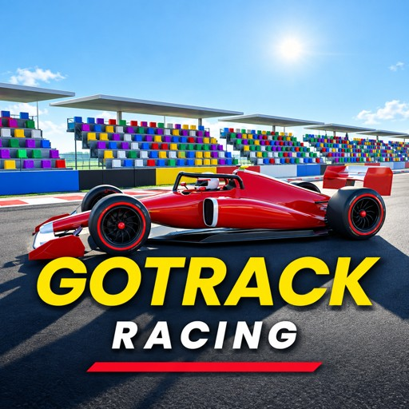

# GoTrack Racing

**A multiplayer Formula-style racing game for Roblox.**

[](https://luau.org/)
[](https://www.python.org/)
[](https://rojo.space/)
[](https://www.blender.org/)
[](https://github.com/lune-org/lune)
[](LICENSE)

[](https://www.roblox.com/share?code=b186e6c9a88cc64bbb3b98de8a618c95&type=ExperienceDetails&stamp=1790784827962)

[Learning](#-learning-from-this-repo) · [Made by](#-made-by) · [Layout](#-repository-layout) · [Architecture](#-architecture) · [Networking](#-networking-and-multiplayer) · [Procedural circuits](#-procedural-circuits) · [Blender pipelines](#-blender-pipelines) · [Testing](#-testing-outside-roblox) · [Tooling](#-tooling-and-workflow)

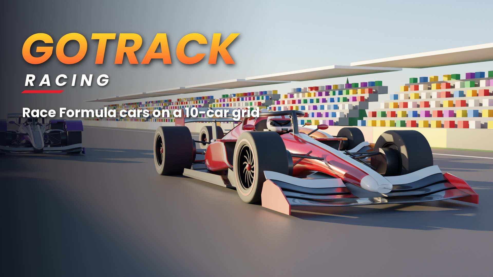

</div>

> [!NOTE]
> **This is a learning project,** made to learn **Luau**, **Blender** and **game development** as a whole: multiplayer networking, saving player data, generating 3D models with code, and testing a game outside Studio. It's public so anyone can read how it works, learn from it, or take inspiration for their own games. It isn't a product, a template or a supported library.

---

## At a glance

| | |
|---|---|
| **Game code** | ~34k lines of Luau (`--!nonstrict`) in 56 modules, synced into Studio with Rojo |
| **Asset code** | ~10k lines of Python that drive Blender (`bpy`) to generate every mesh, plus the renders on this page |
| **Circuits** | 31, built procedurally at load time from a list of control points |
| **Cars** | 13 designs → 633 meshes, all sharing one hitbox and one handling model |
| **World meshes** | 37 designs → 146 meshes (skyscrapers, houses, trees, rocks, mountains, road cars) |
| **Multiplayer** | 10-car races, a server-authoritative race state, and a ranked queue that spans every server |
| **Checks** | The real game code runs outside Roblox (Lune) to build every circuit, play a full race and test the anti-cheat |

---

---

## 📚 Learning from this repo

Every file starts with a short note on what it does, and every function has a one-line comment, so you can open any file and follow along. A good order to read it in:

| To learn about… | Read |
|---|---|
| Keeping every setting in one place | [`src/shared/Config.luau`](src/shared/Config.luau) |
| Maths without the engine: splines, curvature, a speed profile | [`src/shared/Track.luau`](src/shared/Track.luau) |
| Remotes, and packing a car's state into 29 bytes | [`src/shared/Net.luau`](src/shared/Net.luau) |
| Saving player data safely (session locks, autosave) | [`src/server/DataService.luau`](src/server/DataService.luau) |
| A multiplayer race from lobby to results, with a server that checks everything | [`src/server/RaceManager.luau`](src/server/RaceManager.luau) |
| Matching players across servers with MemoryStore and teleports | [`src/server/RankedMatchmaker.luau`](src/server/RankedMatchmaker.luau) |
| Stopping cheated lap times | [`src/server/TimeTrial.luau`](src/server/TimeTrial.luau) |
| A drivable car with raycast suspension | [`src/client/CarController.luau`](src/client/CarController.luau) |
| Smooth movement for other players' cars (dead reckoning) | [`src/client/RemoteCars.luau`](src/client/RemoteCars.luau) |
| A UI design system that works on phones and PCs | [`src/client/UI/Kit.luau`](src/client/UI/Kit.luau) |
| Building a whole world from code | [`src/client/CircuitBuilder.luau`](src/client/CircuitBuilder.luau) |
| Running and testing Luau outside Roblox | [`tools/sim/env.luau`](tools/sim/env.luau) |
| Making 3D models with Python and Blender | [`tools/cargen/`](tools/cargen/), [`docs/CAR_PIPELINE.md`](docs/CAR_PIPELINE.md) |

The 3D assets and the place file aren't in this repo, so it can't be built into the full game as it is. It's meant to be read, studied and experimented with.

---

## 📁 Repository layout

```
src/                      the game (Rojo → GoTrackRacing.rbxlx)
├── shared/               runs on client and server
│   ├── Config.luau         every tunable number: handling, race rules, ranked, economy
│   ├── Track.luau          circuit geometry: pure maths, no Roblox APIs
│   ├── Circuits.luau       31 layouts (control points, laps, theme)
│   ├── Themes.luau         how each country looks (sky, palette, landmarks, weather)
│   ├── Net.luau            remote registry + 29-byte car-state packing
│   ├── CarBuilder.luau     assembles a car from its meshes, paint and anchors
│   └── CarData / WorldData generated by the Blender pipelines (never hand-edited)
├── server/               authoritative services
│   ├── RaceManager         lobbies, sessions, gate validation, standings, results
│   ├── RankedMatchmaker    cross-server queue, reserved match servers
│   ├── TimeTrial           server-validated hot laps and ghosts
│   ├── DataService         session-locked DataStore profiles
│   └── Leaderboard / Champion / Challenge / Monetization services
├── client/               simulation and presentation
│   ├── CarController       raycast-suspension car, client-simulated
│   ├── RemoteCars          other cars from the position stream (dead reckoning)
│   ├── CircuitBuilder …    road, barriers, stands; Landmarks, WorldLife, Cityscape, WorldMeshes
│   └── UI/                 Kit design system + screens
└── first/                loading screen (ReplicatedFirst)
assets/                   (private) meshes, place file and store art
tools/
├── cargen/               Blender car generator  → FBX + CarData.luau
├── worldgen/             Blender world generator → FBX + WorldData.luau
├── tracks/               layout scoring and auto-"twistify" for circuit design
├── sim/                  Lune harness: runs src/ outside Roblox, checks + renderers
├── build.sh · check.sh   Rojo build, luau-lsp type check
docs/                     architecture and the two Blender pipelines
```

`src/` and `assets/` are the source of truth; the place file is only ever built from them. This public repo has the code, tools and docs; the 3D assets, the place file and the store artwork stay private (paths under `assets/` in the docs refer to them).

---

## 🏗️ Architecture

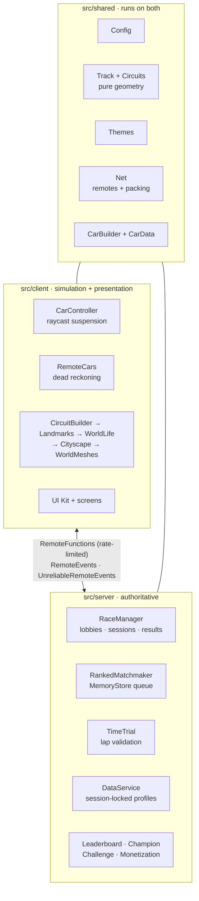
```mermaid
flowchart TB
    subgraph Shared["src/shared · runs on both"]
        Config["Config"]
        Track["Track + Circuits<br/>pure geometry"]
        Themes["Themes"]
        Net["Net<br/>remotes + packing"]
        CarBuilder["CarBuilder + CarData"]
    end
    subgraph Server["src/server · authoritative"]
        RaceManager["RaceManager<br/>lobbies · sessions · results"]
        Matchmaker["RankedMatchmaker<br/>MemoryStore queue"]
        TimeTrial["TimeTrial<br/>lap validation"]
        DataService["DataService<br/>session-locked profiles"]
        Services["Leaderboard · Champion<br/>Challenge · Monetization"]
    end
    subgraph Client["src/client · simulation + presentation"]
        Controller["CarController<br/>raycast suspension"]
        Remote["RemoteCars<br/>dead reckoning"]
        World["CircuitBuilder → Landmarks → WorldLife<br/>→ Cityscape → WorldMeshes"]
        UI["UI Kit + screens"]
    end
    Client <-->|"RemoteFunctions (rate-limited)<br/>RemoteEvents · UnreliableRemoteEvents"| Server
    Shared --- Client
    Shared --- Server
```

**Design rules the code is built around**

- **Server-authoritative where it matters, client-simulated where it's felt.** The server owns coins, XP, purchases, lap and gate validation, results and ranked points. Each client simulates only its own car (instant response on any ping) and streams its state.
- **Shared maths has no engine dependencies.** `Track.luau` turns control points into a centre line, speed profile, gates and grid without touching a Roblox API, so the server, the client and the test harness all run the same code.
- **One place for every number.** Handling, race timings, ranked tiers, matchmaking windows and budgets all live in `Config.luau`. Handling is identical for every car and every purchase, by design.
- **Generated data is never edited by hand.** `CarData.luau` and `WorldData.luau` are written by the Blender pipelines; changing a car means changing its generator.
- **Everything degrades gracefully.** Without the imported meshes, every system falls back to part-built stand-ins. Without DataStores (Studio), profiles run offline. Without MemoryStore or teleports (Studio), ranked falls back to a local lobby.

**Data layer (`DataService`)**
- Profiles load through `UpdateAsync` and take a **session lock** (job id + timestamp, 30 min timeout), so two servers can never write the same player.
- Autosave runs every 90 s, and `BindToClose` flushes every profile on shutdown.
- Before a teleport the profile is saved and the lock released (`ReleaseForTeleport`), so the next server loads it at once. If the teleport fails, `Reclaim` takes the lock back.

---

## 🌐 Networking and multiplayer

**Remote registry.** Every remote name is listed once in `Net.luau`, and the server creates the `Remotes` folder from it. Every RemoteFunction is bound through one `bind()`, which adds `pcall` with friendly errors and a **per-player token bucket**: 15 calls with 5 per second refill, or 10 and 2 per second for heavy reads such as leaderboards and ghosts.

**Car state in 29 bytes.** Cars stream over `UnreliableRemoteEvent` at 20 Hz, packed into a `buffer`:

| bytes | field |
|---|---|
| 4 | `t` f32: race time the state was taken |
| 12 | `x, y, z` f32: position |
| 6 | `yaw, pitch, roll` i16: angles scaled to ±π |
| 6 | `vx, vy, vz` i16: velocity × 20 |
| 1 | flags: wing damage, smoke, ghost, braking, active-aero flap |

The server validates and relays the states in batches. `RemoteCars` uses **dead reckoning**: each packet's timestamp and velocity predict the car to *now*, and corrections are smoothed, so the car you hit is where it really is. Contact is resolved per client against the other cars as solid boxes.

**Race session lifecycle**

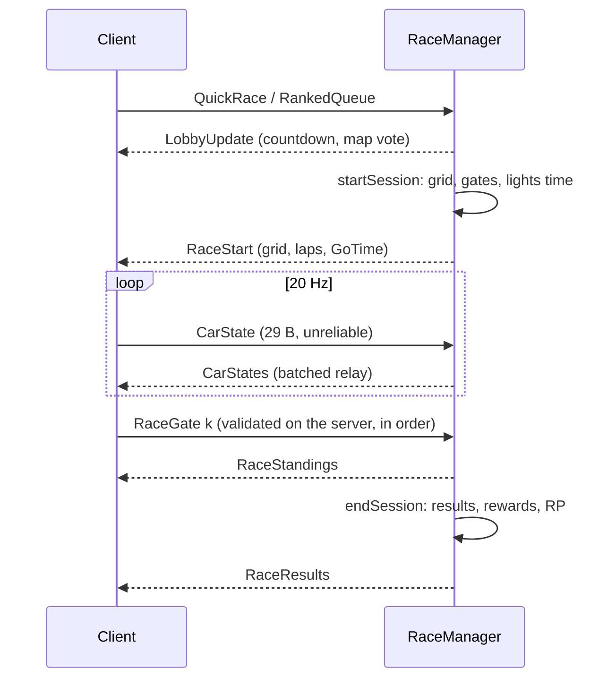
```mermaid
sequenceDiagram
    participant C as Client
    participant S as RaceManager
    C->>S: QuickRace / RankedQueue
    S-->>C: LobbyUpdate (countdown, map vote)
    S->>S: startSession: grid, gates, lights time
    S-->>C: RaceStart (grid, laps, GoTime)
    loop 20 Hz
        C->>S: CarState (29 B, unreliable)
        S-->>C: CarStates (batched relay)
    end
    C->>S: RaceGate k (validated on the server, in order)
    S-->>C: RaceStandings
    S->>S: endSession: results, rewards, RP
    S-->>C: RaceResults
```

**Ranked across servers.** Ranked is real players only, matched across every server of the game:

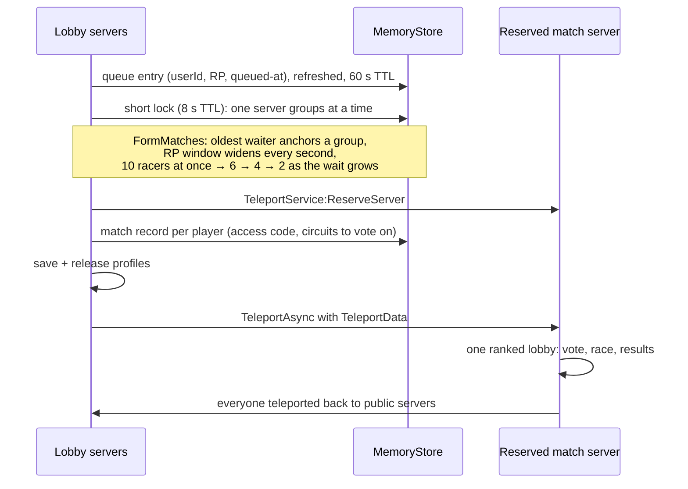
```mermaid
sequenceDiagram
    participant L as Lobby servers
    participant Q as MemoryStore
    participant M as Reserved match server
    L->>Q: queue entry (userId, RP, queued-at), refreshed, 60 s TTL
    L->>Q: short lock (8 s TTL): one server groups at a time
    Note over L,Q: FormMatches: oldest waiter anchors a group,<br/>RP window widens every second,<br/>10 racers at once → 6 → 4 → 2 as the wait grows
    L->>M: TeleportService:ReserveServer
    L->>Q: match record per player (access code, circuits to vote on)
    L->>L: save + release profiles
    L->>M: TeleportAsync with TeleportData
    M->>M: one ranked lobby: vote, race, results
    M->>L: everyone teleported back to public servers
```

A match nobody else reaches is cancelled with no points lost, and latecomers or strangers are sent back. With fewer than 10 racers the points table stretches, so last place always gets last-place points.

**Anti-cheat for Time Trial.** Every lap is checked on the server before it can reach a leaderboard:
- it needs a session token and every timing gate in order;
- it may not be more than 20% faster than the circuit's physics-ideal lap;
- its ghost frames may not move faster than 1.3 × the car's top speed.

`tools/sim/ttcheck.luau` fires real, faked, speed-hacked and teleporting laps at all 31 circuits to prove it.

---

## 🗺️ Procedural circuits

A circuit is just a list of control points plus a theme. Everything else is built on the client in about a second:

| Step | Module | What it adds |
|---|---|---|
| 1 | `Track` | Centripetal Catmull-Rom spline (α = 0.5), resampled every 8 studs; tangents, curvature, banking, elevation; an ideal speed profile from curvature; 24 timing gates, grid slots, a minimap outline |
| 2 | `CircuitBuilder` | Road, kerbs, run-off, barriers (armco, tyre walls, TecPro, street walls), grid, gantry, pit lane, grandstands, marshal posts, floodlights |
| 3 | `Landmarks` | 3-6 signature sights per circuit (105 in total, many animated), plus boats, planes, birds and balloons |
| 4 | `WorldLife` | City street grids with traffic and pedestrians, farm fields, spectator banks, a TV helicopter; every mover animated with one `BulkMoveTo` per frame |
| 5 | `Cityscape` | Fills the land out to the horizon by setting (city grid with downtowns, suburbs, villages, forests, rock formations), nearest land first |
| 6 | `WorldMeshes` | Swaps in the Blender meshes, recoloured per country |
| 7 | sky + horizon | Mountain ranges, mesas or skyline, sky mood, weather, ambient effects |

**Budgets, not guesses.** Each Graphics Quality level has a part budget, and `Cityscape` stops filling when it's spent. A mesh skyscraper costs about 6 parts instead of 40-80, so the busiest circuits dropped from ~38k to ~26k parts while showing more. `PerfOverlay` lowers the quality by itself if a race runs under ~27 FPS.

**The intro camera knows where to look.** The builder measures where the scenery is densest (`ViewAngle`), so the pre-race flyover never opens on an empty side.

<div align="center">
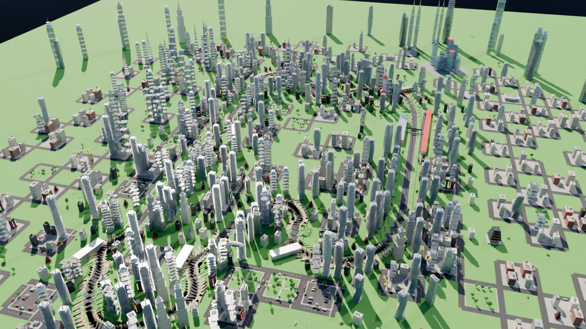 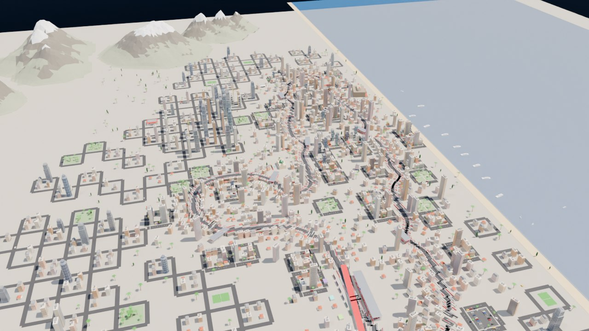
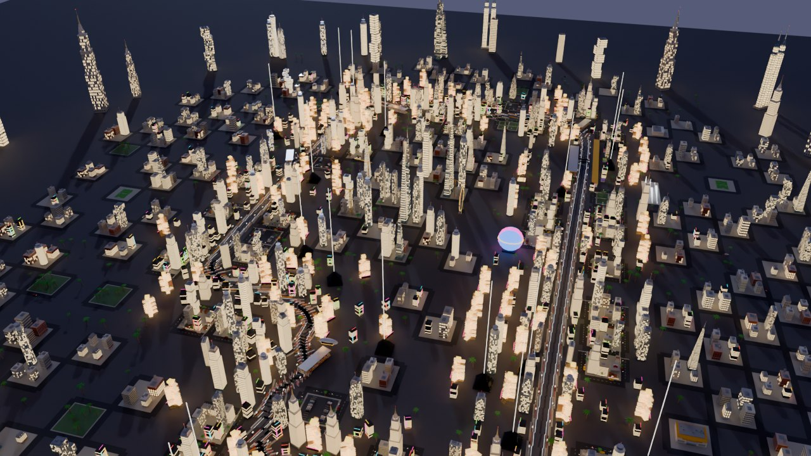 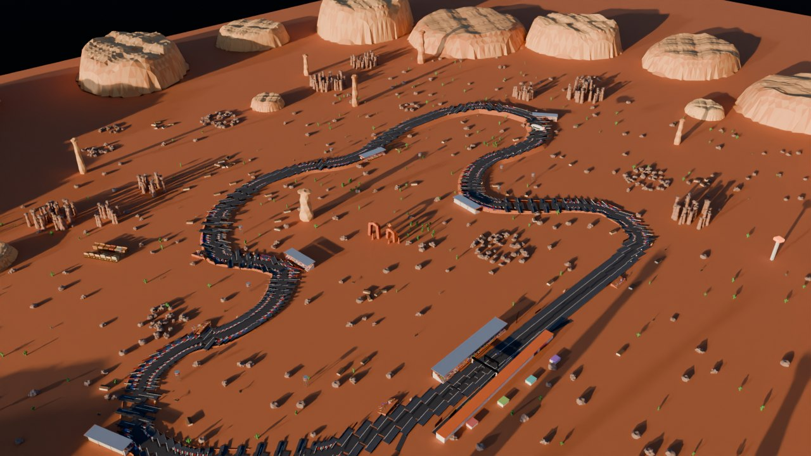
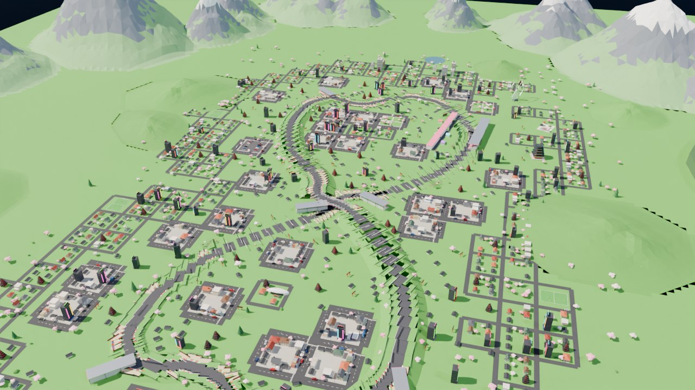 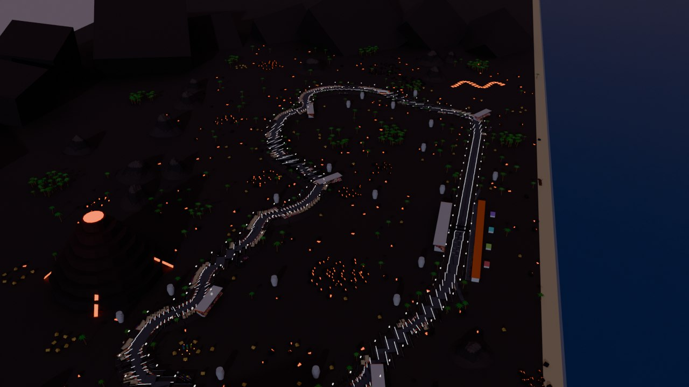
<br><sub>Six of the 31 circuits, built by the game's own CircuitBuilder (run outside Roblox) and rendered with Blender Cycles</sub>
</div>

<details>
<summary><b>All 31 circuits from the air</b></summary>

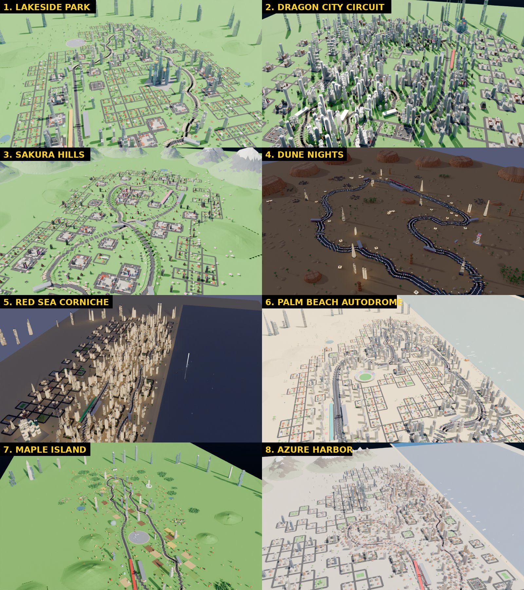
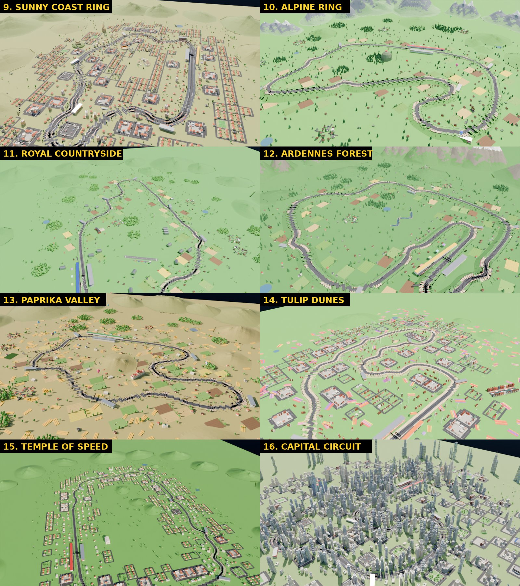
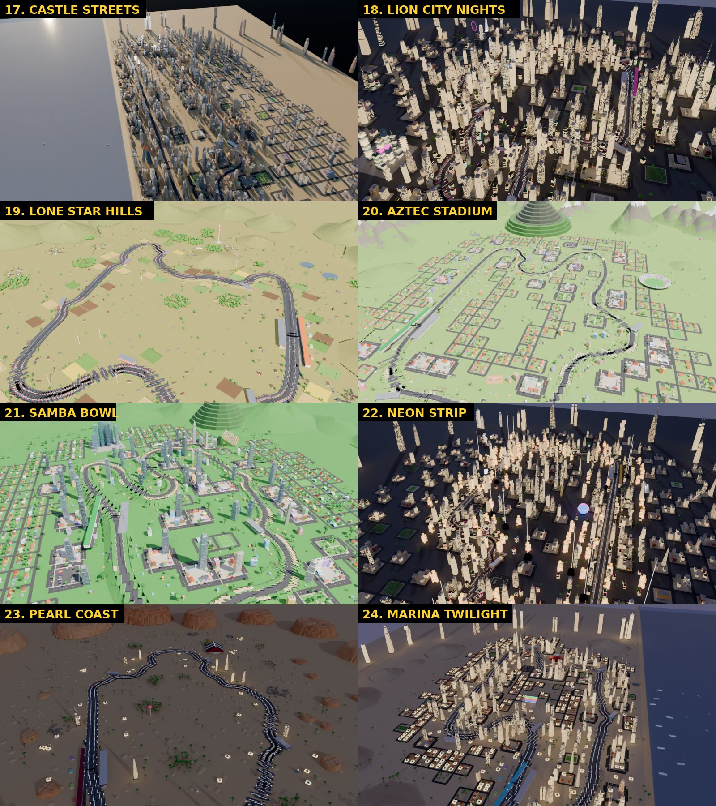
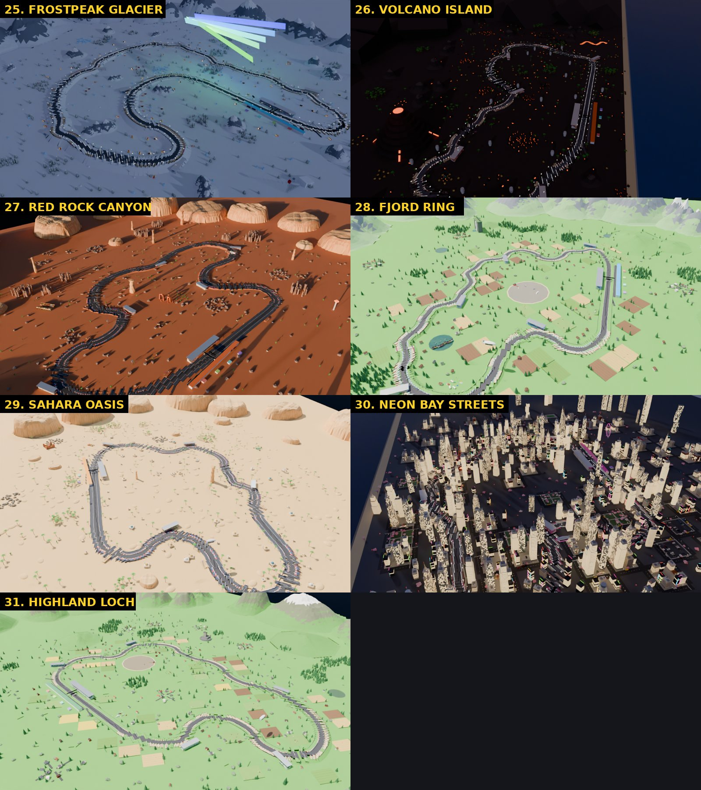

</details>

<details>
<summary><b>Before and after the Blender world (same circuit, same builder)</b></summary>

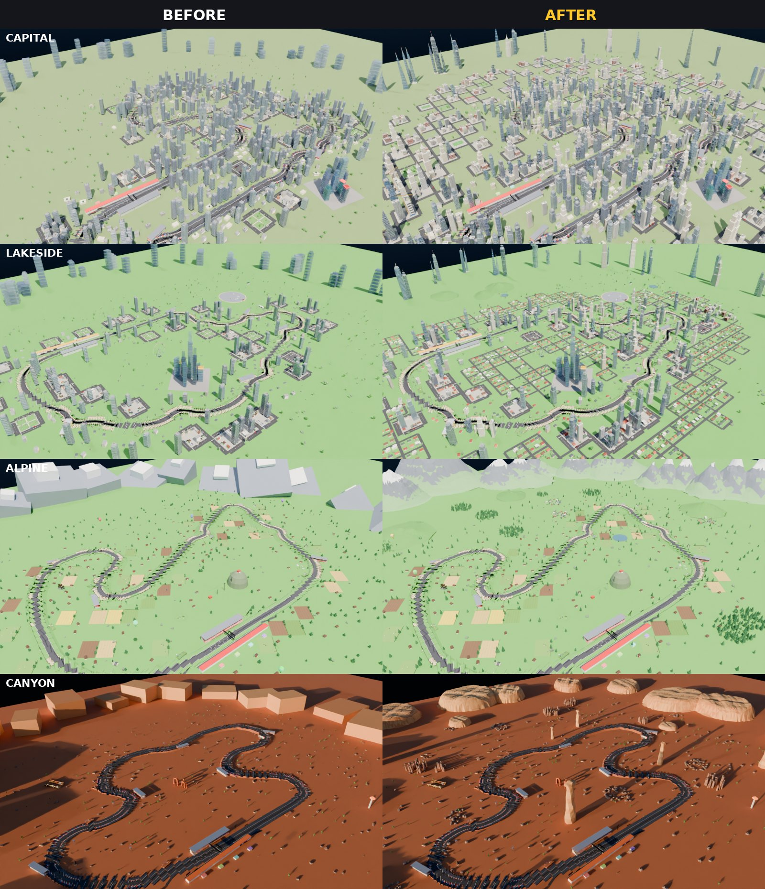

</details>

**Designing layouts.** `tools/tracks` scores a layout without opening Studio: braking zones per lap, hairpins, the share of the lap at full throttle, and sections of road that run too close to each other. `twistify.py` reshapes flat-out layouts automatically toward the targets.

---

## 🧱 Blender pipelines

Nothing in the 3D world is hand-modelled. Python drives **Blender as a library** (`bpy`) to build the geometry, export FBX, and write the Luau data the game reads.

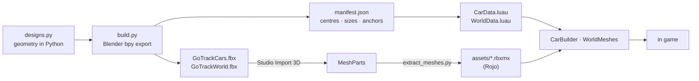
```mermaid
flowchart LR
    A["designs.py<br/>geometry in Python"] --> B["build.py<br/>Blender bpy export"]
    B --> C["GoTrackCars.fbx<br/>GoTrackWorld.fbx"]
    B --> D["manifest.json<br/>centres · sizes · anchors"]
    D --> E["CarData.luau<br/>WorldData.luau"]
    C -->|Studio Import 3D| F["MeshParts"]
    F -->|extract_meshes.py| G["assets/*.rbxmx<br/>(Rojo)"]
    E --> H["CarBuilder · WorldMeshes"]
    G --> H
    H --> I["in game"]
```

**Cars (`tools/cargen`).** There are 13 designs, each built around one idea from an era of F1: 2026 downwash pods, the 2022 zero-pod, the 2017 shark fin, the 2014 finger nose, 1990s gull wings, the 1976 airbox, plus four concepts.
- Each car is split into parts by colour slot (body, wings, pods, halo, helmet, wheels) and **anchors**: head, wheel centres, cockpit and T-cam positions, and the rear-flap hinge for active aero.
- `CarBuilder` assembles any chassis from these parts, so all 13 share one hitbox and one handling model.
- Unit conversion and the importer's 180° turn are handled in one place (`MESH_FIX`).

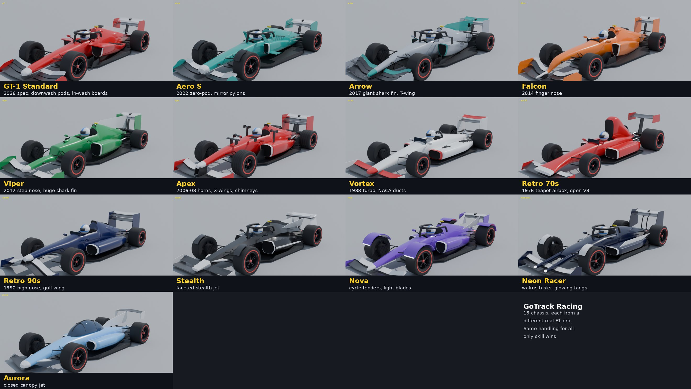

**World (`tools/worldgen`).** 37 designs and 146 meshes (~27k triangles in total):
- 8 skyscraper types, midrises, houses, trees, rocks, mountain peaks, ridges and mesas, and road cars.
- Split by colour slot, so each country repaints them (glass tints, stone, terracotta, autumn leaves, cherry blossom, snow).
- At night, two random halves of the windows can glow.
- Distant mountains use `RenderFidelity = Precise`, because Automatic dropped them to the lowest LOD.

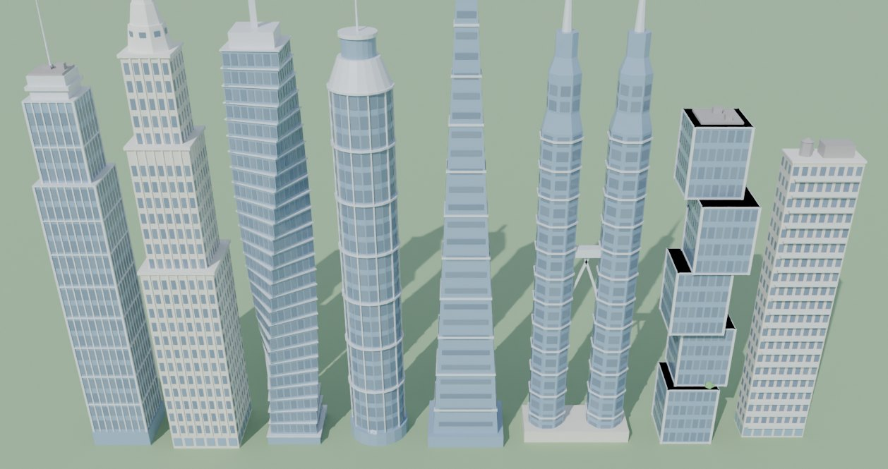
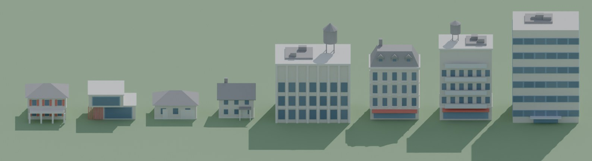
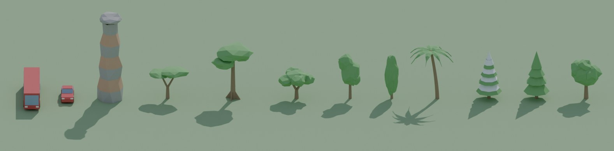

---

## 🧪 Testing outside Roblox

Roblox has no headless test runner, so `tools/sim` runs the **real game modules** under [Lune](https://github.com/lune-org/lune).
- `env.luau` mocks the engine services (RunService, Players, TweenService, DataStores, MemoryStore, TeleportService…).
- It rewrites the few engine-only calls, and loads `src/` behind a `script` tree that mirrors Rojo's, so `require(script.Parent.X)` works unchanged.

| Check | What it proves |
|---|---|
| `maps.luau [quality] [--meshes]` | All 31 circuits build at every graphics level, with and without meshes; per-frame systems don't throw; part counts per circuit |
| `server.luau` | A full race on the server: grid, lights, laps, gates, results, rewards, challenge progress, claims |
| `ranked.luau` | Queue grouping and RP windows, the local lobby waits for a real rival, match servers (cancel, vote, start, latecomers), 5 years of season rollovers |
| `ttcheck.luau` | Time Trial anti-cheat on every circuit: real laps pass, faked / speed-hacked / teleporting laps fail |
| `cars.luau` | All 13 chassis assemble from the real meshes, including the active-aero flap |
| `menu.luau` · `ui.luau` | Every menu page and the circuit intro build with a fake profile, dumped to JSON |

The renderers turn those dumps into pictures:
- `render.py` is a quick 2D painter's-algorithm view.
- `render3d.py` is a real Blender Cycles scene, and every circuit picture on this page comes from it.
- `uirender.py` draws UI screens.

On top of that, `check.sh` runs `luau-lsp` over the whole codebase against a known baseline.

---

## 🛠️ Tooling and workflow

- **Toolchain** pinned with Rokit: Rojo 7.6.1, luau-lsp 1.70.0. `bash tools/build.sh` builds the place, and `bash tools/check.sh` type-checks.
- **Studio round-trip.** Code is synced with `rojo serve`. Mesh imports are the one manual step: Studio's Import 3D, then `extract_meshes.py` pulls the MeshParts back into `.rbxmx` files so the build stays reproducible.
- **One loop for every change.** Pick a task, write down what "done" means, build it, type-check, run the sims, play-test, ship. Three rules never bend: identical handling for every car, never rename a DataStore (it would wipe progress), never hand-edit generated files.
- **Code style.** StyLua for Luau and Ruff for Python, configured in `stylua.toml` and `ruff.toml` at the root.
- **Docs.** [`ARCHITECTURE.md`](docs/ARCHITECTURE.md) · [`CAR_PIPELINE.md`](docs/CAR_PIPELINE.md) · [`WORLD_PIPELINE.md`](docs/WORLD_PIPELINE.md) · [`tools/sim`](tools/sim/README.md) · [`tools/tracks`](tools/tracks/README.md)

---
- **AI was a tool, used to help with the coding.** The direction, the architecture and the design are mine.
---

<div align="center">

**[▶ Play GoTrack Racing on Roblox](https://www.roblox.com/share?code=b186e6c9a88cc64bbb3b98de8a618c95&type=ExperienceDetails&stamp=1790784827962)**

**GoTrack Racing** · © 2026 Bardan Kapri · [MIT licence](LICENSE)

Shared for learning Luau and game development. Read it, learn from it and try things out; just keep the copyright and licence notice if you reuse any of it (see [LICENSE](LICENSE)).

</div>
